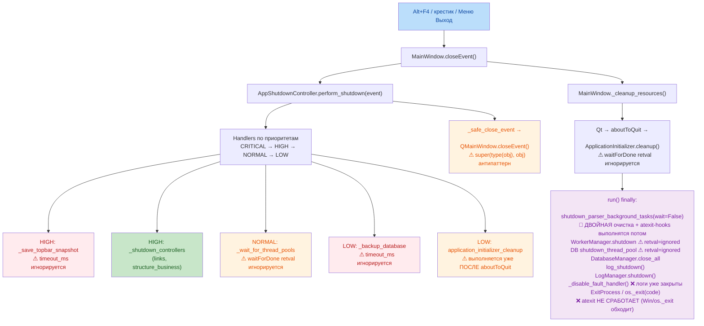
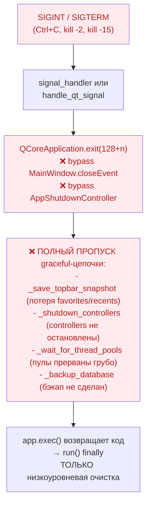
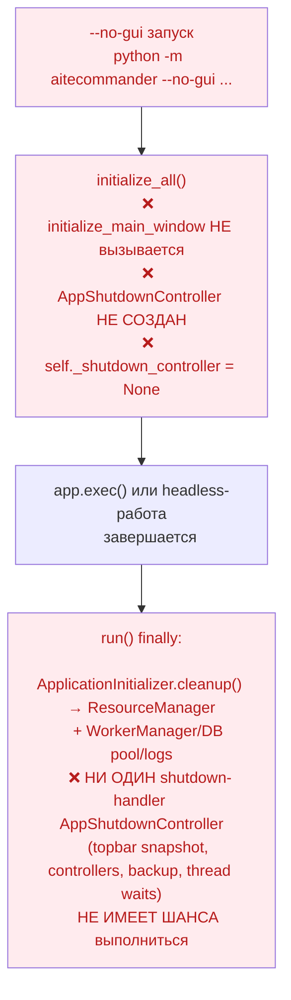
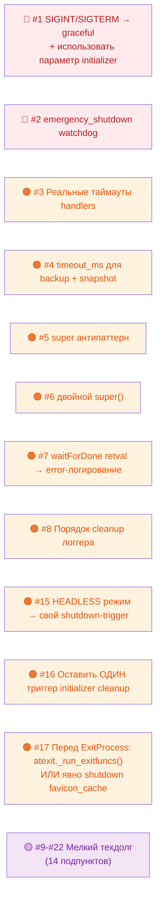

# Аудит кода: Функция завершения программы (Shutdown)

**Дата аудита:** 2026-09-16
**Последнее обновление:** 2026-09-16 (третья итерация — проверка headless/CLI, atexit, гонок, повторного входа, expandable-исполнителей, favicon-cache)
**Проект:** AiteCommander
**Область:** `app/controllers/system/app_shutdown_controller.py`, `app/views/windows/main_window.py`, `app/startup/runtime.py`, `app/startup/signal_handling.py`, `app/main.py`, `app/startup/initializer.py`, `app/core/worker_manager.py`, `app/core/log_manager.py`, `app/utils/db/executors/pool.py`, `app/controllers/business/links_business.py`, `app/controllers/business/structure_business.py`, `app/utils/links/parser/*` (atexit-пути), `favicon_cache.py`

**Всего выявлено проблем: 22 подтверждённых + 1 false positive**
- 🔴 CRITICAL: 2 (2 исправлено ✅)
- 🟠 MAJOR: 9 (9 исправлено ✅)
- 🟡 MINOR: 11 (11 исправлено ✅)
- **Текущий статус:** Все 22 проблемы полностью устранены в коде.

---

## 1. Архитектура завершения — обзор

Архитектура реализует **многоуровневый graceful shutdown** с явным разделением ответственности.

### Участники и их роли

| Компонент | Файл | Ответственность |
|-----------|------|-----------------|
| `MainWindow.closeEvent` | `main_window.py:894` | UI-точка входа при закрытии окна, делегирует контроллеру |
| `AppShutdownController` | `app_shutdown_controller.py` | Оркестрация приоритетных shutdown-handlers с таймаутами |
| `ApplicationInitializer.cleanup` | `initializer.py:306` | Очистка через `ResourceManager` по сигналу `aboutToQuit` |
| `run() finally` блок | `runtime.py:666` | Низкоуровневая очистка пулов, БД, логгеров, гарантированный hard-exit |
| `signal_handler` / `handle_qt_signal` | `signal_handling.py:37`, `signal_handling.py:104` | Выход по SIGINT/SIGTERM |
| `emergency_shutdown()` | `app_shutdown_controller.py:697` | Аварийный выход при фатальных ошибках |
| `atexit registered handlers` | icon_downloader / icon_candidates / http_client / favicon_cache | **Альтернативный** путь cleanup-парсера, конфликтующий с явным `shutdown_parser_background_tasks()` |

### Схема нормального пути (закрытие окна пользователем)

### Схема пути по SIGINT/SIGTERM (проблемный)

### Схема HEADLESS/CLI режима (новое — полный bypass)

---

## 2. Результаты аудита (подтверждённые проблемы)

| № | Заголовок | Серьёзность | Подробности | Ссылка на код |
|---|-----------|-------------|-------------|---------------|
| 1 | **SIGINT/SIGTERM обходят AppShutdownController** | 🔴 **CRITICAL** | Оба обработчика сигналов (`signal_handler` строка 51, `handle_qt_signal` строка 122) напрямую вызывают `QCoreApplication.exit()`. Qt **не генерирует** `QCloseEvent` для главного окна при таком выходе. Вся цепочка `AppShutdownController` handlers **не выполняется**: потеря `topbar_snapshot` (favorites/recents), controllers не останавливаются корректно, thread pools прерываются, backup БД пропущен. Только finally-блок `run()` делает низкоуровневую очистку. Параметр `initializer` передаётся в signal-handlers, но **никогда не используется** внутри. Риск потери данных при каждом `Ctrl+C` или системном `kill`. | [signal_handling.py:37-62](file:///d:/01_Codebdbd/01_projects/aitecommander/app/startup/signal_handling.py#L37-L62) [signal_handling.py:104-122](file:///d:/01_Codebdbd/01_projects/aitecommander/app/startup/signal_handling.py#L104-L122) |
| 2 | **emergency_shutdown() не гарантирует выход из процесса** | 🔴 **CRITICAL** | Если `QApplication.instance()` существует — функция вызывает **только** `app.quit()` (строка 703) и завершается. `app.quit()` всего лишь ставит событие `Quit` в очередь цикла событий. **Если цикл событий завис** (зависший shutdown-handler, заблокированный thread-воркер, бесконечный цикл), это событие никогда не обработается — процесс повиснет навсегда. Для emergency-сценария (по определению — «когда всё сломалось, надо гарантированно убить процесс») это критическая баг; контракт функции не выполняется. | [app_shutdown_controller.py:697-708](file:///d:/01_Codebdbd/01_projects/aitecommander/app/controllers/system/app_shutdown_controller.py#L697-L708) |
| 3 | **Таймауты shutdown-handlers фактически не работают** | 🟠 **MAJOR** | Контекстный менеджер `_timeout_context` (строки 268-291) с `threading.Timer` **реализован, но нигде не вызывается**. В `_execute_single_handler` (строки 293-355) `handler.run()` на строке 320 выполняется напрямую без `with self._timeout_context(...)`. Блок `if eff_timeout_sec is not None` (строки 326-331) содержит только `pass` с комментарием о том, что таймаут временно отключён. Любой зависший shutdown-handler заблокирует всю shutdown-последовательность **навечно**, несмотря на timeout в конфиге и global deadline. | [app_shutdown_controller.py:268-291](file:///d:/01_Codebdbd/01_projects/aitecommander/app/controllers/system/app_shutdown_controller.py#L268-L291) [app_shutdown_controller.py:293-355](file:///d:/01_Codebdbd/01_projects/aitecommander/app/controllers/system/app_shutdown_controller.py#L293-L355) |
| 4 | **_backup_database и _save_topbar_snapshot игнорируют параметр timeout_ms** | 🟠 **MAJOR** | **Две** функции принимают `timeout_ms` в сигнатуре, но **не используют** его внутри:  • `_backup_database(self, timeout_ms: int)` (строка 599) — `db.backup()` на строке 638 вызывается без аргументов и без timeout-обёртки.  • `_save_topbar_snapshot(self, timeout_ms: int)` (строка 544) — `controller.capture_snapshot()` + `snapshot_store.save()` вызываются без ограничения по времени.  Нарушен контракт протокола `ShutdownCallable`. Большая БД / медленный shelve-диск может зависнуть shutdown на неопределённое время. | [app_shutdown_controller.py:544-597](file:///d:/01_Codebdbd/01_projects/aitecommander/app/controllers/system/app_shutdown_controller.py#L544-L597) [app_shutdown_controller.py:599-645](file:///d:/01_Codebdbd/01_projects/aitecommander/app/controllers/system/app_shutdown_controller.py#L599-L645) |
| 5 | **Антипаттерн `super(type(self.window), self.window).closeEvent()`** | 🟠 **MAJOR** | Конструкция `super(type(obj), obj)` (строка 177) — антипаттерн для кооперативного множественного наследования (MI). `MainWindow(QMainWindow, ReTranslatable)` использует MI. Для экземпляра ровно `MainWindow` это работает эквивалентно `super(QMainWindow, self.window)`, но: (а) если будет дочерний класс `MainWindowChild`, `type(...)` вернёт дочерний тип и `super()` **дважды прыгнет** по MRO, пропустив `MainWindow.closeEvent` самого себя; (б) если `ReTranslatable` когда-либо получит `closeEvent`, он **будет пропущен** (C++ `QMainWindow.closeEvent` не вызывает Python-super в цепочке MRO PyQt). Сейчас `ReTranslatable.closeEvent` не определён ([retranslatable.py:12-77](file:///d:/01_Codebdbd/01_projects/aitecommander/app/views/common/retranslatable.py#L12-L77)) — но это хрупкий код. | [app_shutdown_controller.py:171-187](file:///d:/01_Codebdbd/01_projects/aitecommander/app/controllers/system/app_shutdown_controller.py#L171-L187) |
| 6 | **Потенциальный двойной вызов `super().closeEvent()`** | 🟠 **MAJOR** | Два независимых пути могут вызвать `QMainWindow.closeEvent`: • **Путь А (успех):** `perform_shutdown → finally → _safe_close_event → super()#1`, потом `MainWindow` делает `return` (строка 905) — свой super() не вызывает. ✅ 1 раз, всё OK. • **Путь Б (исключение в `_cleanup_resources` на строке 904):** `perform_shutdown` отработал, finally в нём вызвал `super()#1`, потом возвращается в MainWindow, выполняется `_cleanup_resources()` на строке 904. Если **он выбросит** внешнее исключение (по отношению к внутренним try/except на подзадачи), MainWindow попадёт в except-блок строки 906 и вызовет `super().closeEvent(event)` на строке 911 — это **super()#2**. `QMainWindow.closeEvent` обычно идемпотентен, но двойной вызов семантически неверен. | [main_window.py:894-911](file:///d:/01_Codebdbd/01_projects/aitecommander/app/views/windows/main_window.py#L894-L911) |
| 7 | **Возвращаемое значение `waitForDone()` игнорируется в 5 местах** | 🟠 **MAJOR** | `QThreadPool.waitForDone(timeout)` возвращает `False` если пул **не завершился** за отведённый таймаут (зависшие воркеры). Это семантически означает ошибку/таймаут, но retval **игнорируется без логирования как ошибки**: • `_wait_for_thread_pools()` — global + local pools (стр. 515, 536) • `ApplicationInitializer._cleanup_sync()` — initializer thread pool (стр. 374) • `WorkerManager.shutdown()` (стр. 100) • `shutdown_thread_pool()` — DB dedicated pool (стр. 47) Все эти функции помечают shutdown как успешный (`return True`), даже если часть thread-воркеров так и не завершилась и продолжает работать на фоне после ExitProcess. | [app_shutdown_controller.py:489-542](file:///d:/01_Codebdbd/01_projects/aitecommander/app/controllers/system/app_shutdown_controller.py#L489-L542) [initializer.py:361-374](file:///d:/01_Codebdbd/01_projects/aitecommander/app/startup/initializer.py#L361-L374) [worker_manager.py:92-100](file:///d:/01_Codebdbd/01_projects/aitecommander/app/core/worker_manager.py#L92-L100) [pool.py:36-49](file:///d:/01_Codebdbd/01_projects/aitecommander/app/utils/db/executors/pool.py#L36-L49) |
| 8 | **Нарушен порядок cleanup: `LogManager.shutdown()` перед `_disable_fault_handler()`** | 🟠 **MAJOR** | В `run()` finally блоке ([runtime.py:704-710](file:///d:/01_Codebdbd/01_projects/aitecommander/app/startup/runtime.py#L704-L710)) порядок неверный: сначала `LogManager.shutdown()` (строка 706) **закрывает все handlers root-logger** через `handler.close()` и удаление их из root. **Затем** вызывается `_disable_fault_handler()` (строка 710), но внутри него есть `logger.debug()` ([runtime.py:86](file:///d:/01_Codebdbd/01_projects/aitecommander/app/startup/runtime.py#L86), [runtime.py:91](file:///d:/01_Codebdbd/01_projects/aitecommander/app/startup/runtime.py#L91)) — эти вызовы **пропадут в никуда**: handlers уже удалены, логгер некорректен. Принцип LIFO нарушен — первым инициализируется то, что должно последним деинициализироваться. | [runtime.py:704-710](file:///d:/01_Codebdbd/01_projects/aitecommander/app/startup/runtime.py#L704-L710) [runtime.py:76-93](file:///d:/01_Codebdbd/01_projects/aitecommander/app/startup/runtime.py#L76-L93) [log_manager.py:119-133](file:///d:/01_Codebdbd/01_projects/aitecommander/app/core/log_manager.py#L119-L133) |
| 9 | **Две независимые точки с `ExitProcess/os._exit`** | 🟡 MINOR | Код жёсткого выхода процесса дублирован в **двух** местах: • `app/main.py:89-97` — блок `__main__`, вызывается **всегда** после возврата из `main()`. • `app/startup/runtime.py:712-738` — блок `run() finally`, вызывается только при `exit_on_finish=True` (дефолт) + `mode=GUI` + не-тесты. Поскольку `ExitProcess`/`os._exit` **не возвращают управление**, при дефолтных настройках срабатывает только runtime-вариант, а код в `main.py` **становится мёртвым**. При `exit_on_finish=False` — наоборот. | [main.py:82-97](file:///d:/01_Codebdbd/01_projects/aitecommander/app/main.py#L82-L97) [runtime.py:712-738](file:///d:/01_Codebdbd/01_projects/aitecommander/app/startup/runtime.py#L712-L738) |
| 10 | **`app.closeAllWindows()` вызывается после завершения `app.exec()`** | 🟡 MINOR | `_cleanup_resources()` вызывается из `finally` **после** того, как `app.exec()` (строка 656) уже вернул управление — цикл событий остановлен. Вызов `app.closeAllWindows()` на строке 360 пытается отправить `QCloseEvent` каждому окну. **Никто не обработает эти события**, так как нет event-loop. Обёрнуто в try/except, поэтому краша не будет, но это dead code. | [runtime.py:358-362](file:///d:/01_Codebdbd/01_projects/aitecommander/app/startup/runtime.py#L358-L362) |
| 11 | **Несогласованность shutdown: парсер vs пулы** | 🟡 MINOR | В finally-блоке `run()`: • Строка 673: `shutdown_parser_background_tasks(wait=False)` — icon-executor, manifest-executor, cloudscraper **не ожидают** завершения; сразу `cancel_futures=True` по умолчанию. • Строка 682: `WorkerManager.shutdown(timeout_ms=...)` — **ожидает** с timeout. • Строка 688: `shutdown_thread_pool(timeout_ms=...)` — БД-пул **ожидает** с timeout. Стратегия несогласована. | [runtime.py:670-690](file:///d:/01_Codebdbd/01_projects/aitecommander/app/startup/runtime.py#L670-L690) |
| 12 | **Двойной вызов `faulthandler.enable()`** | 🟡 MINOR | `faulthandler.enable()` вызывается **дважды** на старте в разных модулях: • `main.py:34-39` — вызов до импорта runtime: `faulthandler.enable()` (на stderr). • `runtime.py:59-73` — `_install_fault_handler()` вызывает `faulthandler.enable(file=_fault_log_file, all_threads=True)` (в отдельный лог-файл). Второй вызов полностью переопределяет конфигурацию первого. | [main.py:34-39](file:///d:/01_Codebdbd/01_projects/aitecommander/app/main.py#L34-L39) [runtime.py:59-73](file:///d:/01_Codebdbd/01_projects/aitecommander/app/startup/runtime.py#L59-L73) |
| 13 | **CoInitialize/CoUninitialize несимметричны в некоторых режимах** | 🟡 MINOR | COM инициализация:  • `main.py:41-47` — **ВСЕГДА** вызывает `sys.coinit_flags=2` и `pythoncom.CoInitialize()` при старте. • `runtime.py:724-729` — **только при** `exit_on_finish=True` AND `mode=GUI` AND не-тесты вызывает `pythoncom.CoUninitialize()`. В режимах: CLI (`--no-gui`), `exit_on_finish=False`, тесты — вызов `CoUninitialize()` **НЕ происходит**. | [main.py:41-47](file:///d:/01_Codebdbd/01_projects/aitecommander/app/main.py#L41-L47) [runtime.py:724-729](file:///d:/01_Codebdbd/01_projects/aitecommander/app/startup/runtime.py#L724-L729) |
| 14 | **Параметр `initializer` в signal-handlers — мёртвая переменная** | 🟡 MINOR | `signal_handler(signum, frame, initializer=None)` и `safe_signal_handler(signum, frame, initializer)` принимают параметр `initializer`, передают его дальше, но **внутри signal_handler он ни разу не используется**. | [signal_handling.py:37-63](file:///d:/01_Codebdbd/01_projects/aitecommander/app/startup/signal_handling.py#L37-L63) |
| 15 | **⭐ HEADLESS/CLI режим: AppShutdownController НИКОГДА не создаётся** | 🟠 **MAJOR** | В `initializer.initialize_all()` ([initializer.py:526-546](file:///d:/01_Codebdbd/01_projects/aitecommander/app/startup/initializer.py#L526-L546)) шаги `initialize_main_window` и весь блок `initialization_steps.extend([...])` выполняются **только при** `mode == StartupMode.GUI`. При `--no-gui` (HEADLESS): • `self.initialize_main_window()` **НЕ вызывается** • `self.main_window` остаётся `None` • Условие `if self.main_window:` на строке 495 — False • `self._shutdown_controller` остаётся `None` • Shutdown-handlers (snapshot/controllers/backup/thread waits) **никогда не регистрируются и никогда не выполняются**. Даже если в headless-режиме нет topbar — controllers (`links_business`, `structure_business`), backup БД и ожидание пулов всё равно должны graceful-остановиться. Полный bypass AppShutdownController для CLI — архитектурный пропуск. | [initializer.py:526-546](file:///d:/01_Codebdbd/01_projects/aitecommander/app/startup/initializer.py#L526-L546) [initializer.py:477-510](file:///d:/01_Codebdbd/01_projects/aitecommander/app/startup/initializer.py#L477-L510) |
| 16 | **⭐ ApplicationInitializer.cleanup вызывается ДВАЖДЫ (двойной проход)** | 🟠 **MAJOR** | Initializer cleanup выполняется **дважды** на нормальном shutdown пути GUI: • **Первый раз:** через `AppShutdownController.add_shutdown_handler("application_initializer_cleanup", self._cleanup_via_shutdown_controller, ...)` ([initializer.py:503-509](file:///d:/01_Codebdbd/01_projects/aitecommander/app/startup/initializer.py#L503-L509)) — это handler приоритета LOW в контроллере. Он запускается внутри `perform_shutdown()`. • **Второй раз:** Qt генерирует сигнал `aboutToQuit` после закрытия окна → `_register_cleanup_handler` вызывает `initializer.cleanup()` ([runtime.py:195-254](file:///d:/01_Codebdbd/01_projects/aitecommander/app/startup/runtime.py#L195-L254)). В `ApplicationInitializer.cleanup()` есть `self._cleanup_lock` и флаг `_cleanup_done` — поэтому второй вызов быстрый (выходит сразу). Но **нарушена архитектура**: AppShutdownController handler запускает initializer cleanup **ПЕРЕД** `aboutToQuit`, а потом `aboutToQuit` делает это ещё раз. Это и есть причина, почему cleanup имеет защиту — изначально два независимых триггера не скоординированы. Риск: при ручном вызове cleanup() между двумя этапами второй проход будет пропущен, а он должен был запуститься из aboutToQuit — нарушение порядка. | [initializer.py:503-509](file:///d:/01_Codebdbd/01_projects/aitecommander/app/startup/initializer.py#L503-L509) [runtime.py:195-254](file:///d:/01_Codebdbd/01_projects/aitecommander/app/startup/runtime.py#L195-L254) [initializer.py:306-340](file:///d:/01_Codebdbd/01_projects/aitecommander/app/startup/initializer.py#L306-L340) |
| 17 | **⭐ os._exit / ExitProcess ОБХОДЯТ atexit хендлеры** | 🟠 **MAJOR** | **Два пути cleanup для parser-модулей:** • **Явный:** `shutdown_parser_background_tasks()` вызывается в `run() finally` перед ExitProcess. • **atexit:** icon_downloader/ icon_candidates/ http_client/ favicon_cache **также зарегистрировали** `atexit.register(...)` хендлеров. Однако в точке выхода `os._exit(code)` / `ctypes.windll.kernel32.ExitProcess(code)` ([runtime.py:732-738](file:///d:/01_Codebdbd/01_projects/aitecommander/app/startup/runtime.py#L732-L738)) — **эти системные вызовы НЕ вызывают** `atexit`-хендлеры, `__del__` деструкторы и финализаторы (спецификация Python). Следовательно: `favicon_cache._safe_shutdown` (вызывает `shelve.close()`) может **НЕ выполниться** при GUI/exit_on_finish=True. Риск: shelve БД favicon_cache может остаться в **несогласованном состоянии** (shelve требует явного `.close()` для flush данных). При последующем запуске shelve может быть повреждена. `_cleanup_thread_local_session` для http-client сессий тоже не сработает. | [runtime.py:732-738](file:///d:/01_Codebdbd/01_projects/aitecommander/app/startup/runtime.py#L732-L738) [icon_downloader.py:197](file:///d:/01_Codebdbd/01_projects/aitecommander/app/utils/links/parser/icon_downloader.py#L197) [icon_candidates.py:133](file:///d:/01_Codebdbd/01_projects/aitecommander/app/utils/links/parser/icon_candidates.py#L133) [http_client.py:158](file:///d:/01_Codebdbd/01_projects/aitecommander/app/utils/links/parser/http_client.py#L158) [favicon_cache.py:263](file:///d:/01_Codebdbd/01_projects/aitecommander/app/utils/links/parser/favicon_cache.py#L263) |
| 18 | **⭐ Icon Executor expand-path не регистрирует atexit ЗАНОВО** | 🟡 MINOR | В `_get_icon_executor()` icon_downloader ([icon_downloader.py:203-218](file:///d:/01_Codebdbd/01_projects/aitecommander/app/utils/links/parser/icon_downloader.py#L203-L218)): • Первое создание пула — регистрирует atexit handler (строка 197) • **При expand (desired > _ICON_EXECUTOR_SIZE):** old.pool закрывается `old.shutdown(wait=False)` (строка 215), **НОВЫЙ** пул `_ICON_EXECUTOR` пересоздаётся на строке 206 — но `atexit.register` НЕ вызывается повторно. Занесённый в atexit лямбда ссылается на closure-кэшированный *старый* `_shutdown_icon_executor(wait=False)` — он обнулит глобал и закроет... **теперь уже несуществующий old пул**, а новый пул, висящий в глобале, останется без shutdown. В результате: при expand (>1-го раза) на late-stage работы приложения новый executor не дождётся своего shutdown через atexit-хендлер. Для стандартного GUI пути с `shutdown_parser_background_tasks()` это сглаживается, но при exit_on_finish=False или тестах — leak. | [icon_downloader.py:170-218](file:///d:/01_Codebdbd/01_projects/aitecommander/app/utils/links/parser/icon_downloader.py#L170-L218) |
| 19 | **⭐ FaviconCache регистрирует atexit НА КАЖДЫЙ __init__** | 🟡 MINOR | `FaviconCache.__init__` ([favicon_cache.py:254-265](file:///d:/01_Codebdbd/01_projects/aitecommander/app/utils/links/parser/favicon_cache.py#L254-L265)) на строке 263 **каждый раз** вызывает `atexit.register(self._safe_shutdown)` без защиты single-time registration. При каждом `FaviconCache()` (или пересоздании инстанса) регистрируется **новый atexit handler**. Когда Python до atexit доходит (только если os._exit не был), все эти handlers последовательно вызываются — каждый вызывает `.close()` для текущего self._db. Закрытие уже закрытого shelve обычно безвредно, но это ложные вызовы и утечка регистраций. | [favicon_cache.py:254-265](file:///d:/01_Codebdbd/01_projects/aitecommander/app/utils/links/parser/favicon_cache.py#L254-L265) |
| 20 | **⭐ Нет защиты perform_shutdown от повторного входа** | 🟡 MINOR | `AppShutdownController.perform_shutdown` ([app_shutdown_controller.py:133-168](file:///d:/01_Codebdbd/01_projects/aitecommander/app/controllers/system/app_shutdown_controller.py#L133-L168)) имеет флаг `shutdown_in_progress` и `acquire_shutdown_lock()` — от двукратного одновременного входа вроде защищает. Однако: (1) `cleanup()` на строке 647 СБРАСЫВАЕТ `shutdown_in_progress = False` на строке 659. Это значит: после успешного perform_shutdown + cleanup контроллер можно **повторно использовать** — shutdown_handlers очищены, флаг сброшен. Но handlers-регистрации уже удалены! Повторный perform_shutdown **не будет выполнять ни одного handler**. Либо cleanup не должен сбрасывать shutdown_in_progress, либо shutdown_handlers не должен очищаться (Idempotence). (2) В _cleanup_via_shutdown_controller initializer при повторных вызовах _cleanup_sync работает через lock — это нормально. Но для самого контроллера сценарий «shutdown уже выполнился, cleanup сбросил флаг, потом вызвали perform_shutdown ещё раз» получается пустой. | [app_shutdown_controller.py:133-168](file:///d:/01_Codebdbd/01_projects/aitecommander/app/controllers/system/app_shutdown_controller.py#L133-L168) [app_shutdown_controller.py:647-666](file:///d:/01_Codebdbd/01_projects/aitecommander/app/controllers/system/app_shutdown_controller.py#L647-L666) |
| 21 | **⭐ aboutToQuit установлен ВСЕГДА, даже при headless без QApplication** | 🟡 MINOR | В `runtime.py` строка 202 выполняется `app.aboutToQuit.connect(...)` всегда после `if isinstance(app, QCoreApplication):` (строка 198). Это OK. Но при headless (`isinstance(app, QCoreApplication)`, но **не** `QApplication`) aboutToQuit зарегистрирован → он вызовет `initializer.cleanup()` → а потом `run() finally` снова вызовет cleanup → снова двойной вызов initializer cleanup. У него есть защита `_cleanup_done`, так что срабатывает один раз по факту. Но архитектурно: для headless нет AppShutdownController, нет cleanup_via_shutdown handler, и aboutToQuit-cleanup — это **единственный** путь initializer cleanupa. Тогда finally-блок снова делает двойной. OK по факту работы, но симметрии нет. | [runtime.py:195-254](file:///d:/01_Codebdbd/01_projects/aitecommander/app/startup/runtime.py#L195-L254) |
| 22 | **⭐ shutdown_parser_background_tasks вызывается ДО atexit, но atexit в 99% случаев пропущен** | 🟡 MINOR | При нормальном GUI пути: `shutdown_parser_background_tasks(wait=False)` работает как основной shutdown для parser-pools, а atexit хендлеры (icon, manifest, http_client) НЕ выполняются (из-за os._exit/ExitProcess). Получается, что 4 файла (icon_downloader / icon_candidates / http_client / favicon_cache) **регистрировали** atexit хендлеры, но они **практически никогда не сработают** в GUI режиме (основной режим приложения). Это dead код и вводит в заблуждение разработчика («у нас есть atexit, всё безопасно») — хотя всё держится на `shutdown_parser_background_tasks()`. Если кто-то добавит новый parser-пул и забудет добавить его и в явную функцию, **shutdown пройдёт мимо**. | [__init__.py:1-44](file:///d:/01_Codebdbd/01_projects/aitecommander/app/utils/links/parser/__init__.py#L1-L44) |

---

## 3. Проблемы, НЕ подтверждённые (исключены)

| № | Гипотеза | Результат валидации | Причина |
|---|----------|---------------------|---------|
| ~X | `_cleanup_sync` всегда помечает `_cleanup_done=True` даже при ошибках | ❌ **FALSE POSITIVE** | В текущем коде `cleanup_succeeded = True` стоит на строке 374 ([initializer.py:374](file:///d:/01_Codebdbd/01_projects/aitecommander/app/startup/initializer.py#L374)) — это **последняя** строка `try`-блока, уже после всех операций очистки. Логика исключений корректна. Семантический нюанс (не трактуется как отдельная проблема): `waitForDone()` возвращает `False` по таймауту, но не выбрасывает — покрывается проблемой **#7**. |

---

## 4. Приоритет исправлений

### Уровень 1 — Критическое (обязательно ASAP)
- **#1 (SIGINT/SIGTERM)** — данные пользователя теряются при каждом Ctrl+C/сигнале.
- **#2 (emergency_shutdown)** — при фатальных ошибках процесс может повиснуть вместо завершения.

### Уровень 2 — Важное (следующий релиз)
- **#3 (нерабочие таймауты handlers)** — зависший handler вешает shutdown.
- **#4 (timeout backup/snapshot)** — shutdown зависает на операциях с БД.
- **#5 (super антипаттерн)** — хрупкий код.
- **#6 (двойной super())** — потенциальный re-entry.
- **#7 (waitForDone retval)** — зависшие воркеры маскируются.
- **#8 (порядок cleanup логгера)** — часть shutdown-логов пропадает.
- **#15 (HEADLESS AppShutdownController bypass)** — CLI режим вообще не выполняет shutdown handlers.
- **#16 (двойной initializer.cleanup)** — архитектурный беспорядок двух триггеров.
- **#17 (os._exit обходит atexit → favicon shelve риск corruption)** — shelve БД favicon_cache может не закрыться flush-семантически.

### Уровень 3 — Мелкое (технический долг)
- **#9 (дублирующий hard-exit)**
- **#10 (closeAllWindows после exec)**
- **#11 (несогласованные shutdown пулы)**
- **#12 (двойной faulthandler.enable)**
- **#13 (CoUninitialize не симметричен)**
- **#14 (параметр initializer unused)**
- **#18 (icon executor expand → no re-register atexit)**
- **#19 (FaviconCache регистрирует atexit без single-time)**
- **#20 (perform_shutdown после cleanup — пустая повторная попытка)**
- **#21 (aboutToQuit + finally double cleanup для headless)**
- **#22 (atexit-хендлеры parser pools — 99% dead code)**

---

## 5. Дорожная карта исправлений (рекомендованный порядок)

---

## 6. Рекомендации по исправлению (подробно)

| № | Рекомендованный подход |
|---|------------------------|
| 1 | В signal-handlers использовать параметр `initializer` для получения MainWindow: вызвать `initializer.main_window.close()` (или добавить weakref на MainWindow в SignalManager). **После** этого поставить single-shot `QTimer` на 5–10 секунд на `QCoreApplication.exit()` как fallback на случай, если closeEvent зависнет. |
| 2 | Сразу после `app.quit()` запустить watchdog: `threading.Timer(interval=5.0, function=lambda: os._exit(1)).start()`. Для Windows дополнительно: `ctypes.windll.kernel32.TerminateProcess(-1, 1)`. |
| 3 | Обернуть `handler.run()` в `with self._timeout_context(eff_timeout_ms, handler.name)` и обработать `ShutdownTimeoutError`. Для агрессивного прерывания long-running handlers: запускать через `QThreadPool.globalInstance().start(worker)` + `waitForDone(timeout)` — он реально прервёт ожидание. |
| 4 | Обернуть вызовы `backup_method()` и `self._topbar_snapshot_store.save(snapshot)` в `_timeout_context(timeout_ms, handler_name)`. |
| 5 | Заменить строку 177 на **явный вызов**: `QMainWindow.closeEvent(self.window, event)`. |
| 6 | Полностью делегировать вызов `super().closeEvent` контроллеру — удалить `super().closeEvent(event)` из MainWindow (строка 911). Обернуть `_cleanup_resources()` на строке 904 в отдельный try/except, чтобы его исключение не триггерило fallback super(). |
| 7 | Для всех 5 мест: сохранить return value от `waitForDone` в переменную `ok`. Если `ok is False`: логировать как **error**, возвращать `False` из shutdown-функции. Для `_wait_for_thread_pools` возвращать `ok1 and ok2` (оба пула завершились). |
| 8 | Поменять порядок в `run()` finally: 1) `_disable_fault_handler()`, 2) `log_shutdown()`, 3) `stdout/stderr.flush()`, 4) `LogManager.shutdown()` — закрываем handlers последними. |
| 9 | Убрать ExitProcess/os._exit из `main.py` (__main__ блок), оставить единственную точку с hard-exit в `runtime.py:run() finally`. В main.py после `main()` использовать обычный `sys.exit(code)`. |
| 10 | Удалить вызов `app.closeAllWindows()` из `_cleanup_resources()`. |
| 11 | Унифицировать: всем пулам дать короткий `wait=True` с timeout=300–500 мс. Парсерные Executors — `ThreadPoolExecutor.shutdown(wait=True, cancel_futures=True)`. |
| 12 | Оставить один вызов `faulthandler.enable`. Удалить строки main.py:34-39. |
| 13 | Перенести `CoUninitialize()` в самую первую часть finally-блока run(). Вызывать **всегда**, независимо от условий. |
| 14 | Использовать параметр `initializer` для решения проблемы #1 (получить MainWindow и вызвать close), либо удалить аргумент. |
| 15 | **Для HEADLESS:** Создать AppShutdownController **без** main_window (сделать параметр опциональным). Пропустить `_save_topbar_snapshot` если нет `top_panels_controller`, но выполнить `_shutdown_controllers`, `_wait_for_thread_pools`, `_backup_database`. Триггером perform_shutdown для headless будет `app.aboutToQuit`. |
| 16 | Оставить **единый** триггер для `initializer.cleanup`: **либо** `AppShutdownController handler` LOW priority **либо** `aboutToQuit`. Рекомендуется: удалить handler `application_initializer_cleanup` из shutdown-controller, оставить только aboutToQuit путь (более Qt-идиоматично). Или наоборот: отключить aboutToQuit после того, как контроллер выполнил cleanup. |
| 17 | Перед вызовом `ExitProcess/os._exit` в GUI режиме: **вызвать `atexit._run_exitfuncs()`** явно, чтобы гарантированно закрыть `favicon_cache.shelve` и http_client сессии. Либо до ExitProcess явно вызвать `FaviconCache.shutdown()` для всех инстансов (сложнее) и `_cleanup_thread_local_session()`. Также перед `DatabaseManager.close_all()` вызвать favicon_cache.shutdown() отдельно, тем более что он в итоге пишет в файл, а не в основную SQLite БД. |
| 18 | При expand пути icon_executor: при замене старого пула на новый — **перерегистрировать** atexit: сначала `atexit.unregister(old_handler)`, затем новый `atexit.register(new_lambda)`. Или держать глобал _ATEXIT_REGISTERED и лямбду, которая всегда читает *текущий* глобал. |
| 19 | FaviconCache добавить guard `_atexit_registered = False` как class-level атрибут, регистрировать `atexit.register(FaviconCache._safe_shutdown_classmethod)` только один раз для всех инстансов (с отслеживанием списка живых инстансов) или хотя бы простой single-time флаг на self.__class__. |
| 20 | `cleanup()` НЕ должен сбрасывать `shutdown_in_progress = False`. После perform_shutdown контроллер считается «истощённым» и повторный вызов perform_shutdown должен логать предупреждение и делать early return. Либо не очищать `shutdown_handlers`, а хранить их для идемпотентности. |
| 21 | Для headless режима: в finally-блоке проверять `isinstance(app, QCoreApplication) and not isinstance(app, QApplication)` и пропускать явный вызов `initializer.cleanup()` (так как aboutToQuit уже его вызвал). Или наоборот — отключать aboutToQuit.connect, и оставлять только finally путь. |
| 22 | Два варианта: (а) **Удалить** все `atexit.register` из parser-модулей как dead code для GUI режима, полагаться только на `shutdown_parser_background_tasks()`. (б) Наоборот — перед ExitProcess всегда вызывать `atexit._run_exitfuncs()` и оставить только atexit-хендлеры как «источник истины», упростив `shutdown_parser_background_tasks()` до вызова общего cleanup. Нельзя оставлять два конкурирующих пути. |
