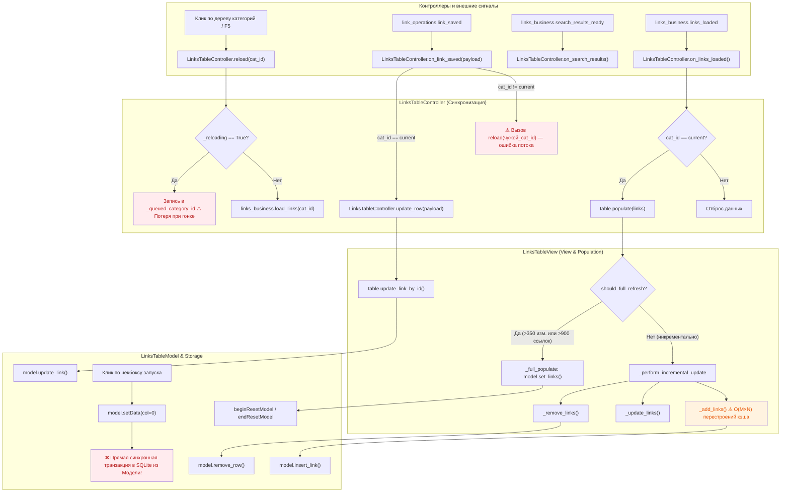

# Аудит кода: Таблица ссылок (LinksTableView / TableController / LinksTableModel)

**Дата аудита:** 2026-09-16  
**Проект:** AiteCommander  
**Область аудита:**  
- Представление (View): `app/views/widgets/link/base_table.py` (`LinksTableView`, `TableDelegate`)  
- Модель данных (Model): `app/views/widgets/link/links_model.py` (`LinksTableModel`)  
- Контроллер таблицы (Controller): `app/controllers/ui/links/table_controller.py` (`LinksTableController`)  
- Миксины таблицы (Mixins):  
  - `app/views/widgets/link/data_management.py` (`DataManagementMixin`)  
  - `app/views/widgets/link/population_manager.py` (`PopulationManagerMixin`)  
  - `app/views/widgets/link/row_operations.py` (`RowOperationsMixin`)  
  - `app/views/widgets/link/item_builders.py` (`ItemBuildersMixin`)  
- Drag-and-Drop & Base Widgets: `app/utils/ui/dnd/link.py`, `app/views/widgets/base/base_widgets.py`  
- Интеграция событий и сигналов: `app/controllers/ui/links/handlers.py`, `app/controllers/ui/links/controller.py`  

**Всего выявлено проблем: 22 подтверждённых + 3 false positive**
- 🔴 **CRITICAL:** 4  
- 🟠 **MAJOR:** 7  
- 🟡 **MINOR:** 11  
- ❌ **FALSE POSITIVES:** 3 (проверены и исключены)  

---

## 1. Архитектура таблицы — обзор

Центральный компонент приложения — таблица ссылок (`LinksTableView`) — построен на архитектуре **Qt Model/View** с множественным наследованием через миксины и внешним контроллером жизненного цикла (`LinksTableController`).

### Участники и их роли

| Компонент | Файл | Ответственность |
|---|---|---|
| `LinksTableView` | `base_table.py:263` | Основной UI-виджет (наследник `QTableView`), композиция всех миксинов, настройка колонок, шрифтов, заголовков |
| `TableDelegate` | `base_table.py:35` | Отрисовка ячеек: чекбокс группы, ховер строки, цвета колонок, обрезка текста (elision), обработка кликов |
| `LinksTableModel` | `links_model.py:47` | Источник данных (`QAbstractTableModel`), сортировка, перемещение строк, хранение `_links`, кэш иконок |
| `LinksTableController` | `table_controller.py:26` | Координация загрузки данных по категориям, точечных обновлений (`on_link_saved`), результатов поиска |
| `PopulationManagerMixin` | `population_manager.py:16` | Алгоритм обновления таблицы: инкрементальное обновление vs полный сброс (`set_links`), сохранение скролла |
| `RowOperationsMixin` | `row_operations.py:12` | Низкоуровневые операции: точечный поиск строки по ID, вставка, удаление, пакетные операции со строками |
| `DataManagementMixin` | `data_management.py:13` | Вторичный кэш строк `{row: link_dict}`, валидация целостности кэша, сравнение равенства данных |
| `ItemBuildersMixin` | `item_builders.py:11` | Форматирование текстовых представлений DisplayRole/ToolTipRole (имена, даты, breadcrumb-пути) |
| `DragDropHandlerMixin` | `dnd/link.py:28` | Специфика Drag & Drop для таблицы ссылок, вычисление целевой строки, извлечение ID из MIME |
| `BaseDragDropTableWidget` | `base_widgets.py:287` | Базовый класс таблицы: eventFilter для вьюпорта, переопределение drag/drop событий Qt |

---

### Схема потоков данных и жизненного цикла (Data Flow)



---

## 2. Результаты аудита (подтверждённые проблемы)

| № | Заголовок | Серьёзность | Подробности | Ссылка на код |
|---|-----------|-------------|-------------|---------------|
| 1 | **Прямой вызов синхронных транзакций SQLite из `LinksTableModel.setData`** | 🔴 **CRITICAL** | В `LinksTableModel.setData()` при клике на чекбокс группового запуска (колонка 0) напрямую импортируется класс БД и выполняется синхронная транзакция SQLite в GUI-потоке: `from app.models.db import Database; db = Database(); with db.transaction(): db.links.update_group_launch(link_id, val_int)`. Грубейшее нарушение MVC: модель представления выполняет дисковый I/O. Если база данных заблокирована фоновым процессом (бэкап, парсер иконок), весь графический интерфейс зависает. Изменение происходит в обход бизнес-контроллеров и стека Undo/Redo. | [links_model.py:261-270](file:///d:/01_Codebdbd/01_projects/aitecommander/app/views/widgets/link/links_model.py#L261-L270) |
| 2 | **Фатальный сбой (TypeError crash) в `BaseDragDropTableWidget._extract_id_from_index`** | 🔴 **CRITICAL** | В базовом классе `BaseDragDropTableWidget` метод `_extract_id_from_index()` пытается преобразовать данные `UserRole` через `return int(data)`. Однако в `LinksTableModel.data()` по роли `UserRole` возвращается **словарь** (`dict`). Вызов `int({'id': 10, ...})` неминуемо падает с `TypeError: int() argument must be a string, a bytes-like object or a real number, not 'dict'`. При этом в docstring метода прямо написано: *"The model must store either a dict with an id key or an integer identifier"*, но ветка извлечения `data.get("id")` не написана вовсе. | [base_widgets.py:644-650](file:///d:/01_Codebdbd/01_projects/aitecommander/app/views/widgets/base/base_widgets.py#L644-L650) |
| 3 | **Гонка категорий и рассинхрон при сохранении ссылки в другой категории (`on_link_saved`)** | 🔴 **CRITICAL** | В `LinksTableController.on_link_saved()`: если сохранена ссылка с категорией `cat_id != current_category_id` (например, ссылку переместили в другую категорию через диалог), контроллер выполняет `self.reload(cat_id)`. Это приводит сразу к двум критическим багам: 1) В текущей открытой категории перемещённая ссылка **остаётся отображаться** (таблица текущей категории не обновляется). 2) Контроллер ставит загрузку чужой категории, которая при поступлении в `on_links_loaded` просто молча отбрасывается (`category_id != current_category_id`), но при этом пока шла загрузка, `_reloading = True` блокировал любые другие действия пользователя. | [table_controller.py:286-293](file:///d:/01_Codebdbd/01_projects/aitecommander/app/controllers/ui/links/table_controller.py#L286-L293) |
| 4 | **Избыточные фоновые загрузки из-за одиночной `_queued_category_id`** | 🔴 **CRITICAL** | `LinksTableController.reload()` использует простую переменную `_queued_category_id` вместо очереди. Если при активной загрузке категории 1 кликнуть категорию 2, а затем категорию 1: проверка `category_id == self._current_category_id` сочтёт возврат дубликатом и проигнорирует его. По завершении контроллер запустит загрузку категории 2. Визуального рассинхрона не будет (защищает проверка `category_provider`), но произойдёт пустая фоновая загрузка, а обновление категории 1 не будет выполнено. | [table_controller.py:90-116](file:///d:/01_Codebdbd/01_projects/aitecommander/app/controllers/ui/links/table_controller.py#L90-L116) |
| 5 | **Квадратичная алгоритмическая сложность $O(M \times N)$ в `_add_links` из-за каскадных `rebuild_cache_from_items`** | 🟠 **MAJOR** | В `RowOperationsMixin._add_links()` при добавлении $M$ ссылок для каждой из них вызывается `_add_row()`. Внутри `_add_row()` на строке 227 каждый раз вызывается `table.rebuild_cache_from_items()`. Этот метод выполняет полный цикл $O(N)$ по всем строкам модели через `model.index()` и `model.data(UserRole)`. При добавлении 100 ссылок в категорию на 500 элементов выполняется $100 \times 500 \approx 50\,000$ вызовов COM/C++ Qt-модели в UI-потоке, вызывая глухое зависание окна. А затем в `population_manager.py:200` кэш перестраивается в 101-й раз. | [row_operations.py:227](file:///d:/01_Codebdbd/01_projects/aitecommander/app/views/widgets/link/row_operations.py#L227)<br>[row_operations.py:449](file:///d:/01_Codebdbd/01_projects/aitecommander/app/views/widgets/link/row_operations.py#L449)<br>[population_manager.py:200](file:///d:/01_Codebdbd/01_projects/aitecommander/app/views/widgets/link/population_manager.py#L200) |
| 7 | **Нарушение контракта Qt Model: отсутствие `changePersistentIndexList` при перемещении строк** | 🟠 **MAJOR** | В `LinksTableModel.move_rows()` для перемещения разреженных строк (sparse move) используются сигналы `layoutAboutToBeChanged` и `layoutChanged`. Согласно контракту Qt, модель **обязана** вызвать `self.changePersistentIndexList(from_indexes, to_indexes)`. Без этого `QItemSelectionModel`, текущий активный индекс и делегаты сохраняют устаревшие указатели на строки. Это ведёт к рассинхрону выделения, случайным прыжкам курсора и возможным сбоям в C++ ядре `QTableView`. | [links_model.py:410-424](file:///d:/01_Codebdbd/01_projects/aitecommander/app/views/widgets/link/links_model.py#L410-L424) |
| 8 | **Двойной клик по чекбоксу переключает состояние 3 раза вместо 2** | 🟠 **MAJOR** | В `TableDelegate.editorEvent()` строка 234 обрабатывает `MouseButtonDblClick` точно так же, как `MouseButtonRelease`. В цикле двойного клика Qt генерирует: Press (return True) → Release (переключение 1) → DblClick (переключение 2) → Release (переключение 3). В итоге двойной клик инвертирует состояние вместо возврата к исходному, порождая три синхронные транзакции в SQLite. | [base_table.py:234-257](file:///d:/01_Codebdbd/01_projects/aitecommander/app/views/widgets/link/base_table.py#L234-L257) |
| 9 | **Полная потеря пользовательского выделения при обновлениях таблицы** | 🟠 **MAJOR** | В `population_manager.py:228` метод `_capture_ui_state()` сохраняет список выбранных строк `current_selection`, передаёт его в `_restore_ui_state(current_selection, ...)`, но на строке 347 весь код восстановления выделения удалён с комментарием *"intentionally removed"*. При любом обновлении данных (сохранение заметки, переключение звёздочки, переименование ссылки) фокус и синяя подсветка выбранной строки полностью исчезают. Из-за этого другим контроллерам пришлось городить костыли с таймерами (`schedule_restore_selection` через 100 мс). | [population_manager.py:228](file:///d:/01_Codebdbd/01_projects/aitecommander/app/views/widgets/link/population_manager.py#L228)<br>[population_manager.py:347](file:///d:/01_Codebdbd/01_projects/aitecommander/app/views/widgets/link/population_manager.py#L347)<br>[links_actions.py:157-182](file:///d:/01_Codebdbd/01_projects/aitecommander/app/controllers/ui/links/links_actions.py#L157-L182) |
| 10 | **Архитектурный дуализм кэша: рассинхронизация `LinksTableModel._links` и `LinksTableView._current_links`** | 🟠 **MAJOR** | Данные таблицы хранятся одновременно в двух независимых структурах: в модели `LinksTableModel._links` (`list[dict]`) и во вью `DataManagementMixin._current_links` (`dict[int, dict]`, где ключ — номер строки). Любая сортировка, перемещение или точечное удаление строки мгновенно делает ключи словаря ложными. Метод `validate_cache_integrity()` постоянно фиксирует сбои и пишет в лог ошибки `Cache size mismatch` и `Invalid cache index`. Присутствие двух источников правды — фундаментальный антипаттерн. | [data_management.py:31-70](file:///d:/01_Codebdbd/01_projects/aitecommander/app/views/widgets/link/data_management.py#L31-L70)<br>[base_table.py:392](file:///d:/01_Codebdbd/01_projects/aitecommander/app/views/widgets/link/base_table.py#L392) |
| 11 | **Множественные дублирующие перестроения кэша при DnD (2–3 раза на одно перемещение)** | 🟠 **MAJOR** | При перетаскивании строки: `model.move_rows()` инициирует сигнал `rowsMoved`, вызывающий `_rebuild_cache_on_layout -> rebuild_cache_from_items()`. Затем `_move_row_visually()` в блоке `finally` вызывает `_rebuild_current_links()`. Если вызов шёл через внешнюю функцию `move_row_visually()` из `dnd/link.py`, она вызывает `_rebuild_current_links()` третий раз. На каждый drop происходит трёхкратный скан всей таблицы в UI-потоке. | [base_table.py:628-644](file:///d:/01_Codebdbd/01_projects/aitecommander/app/views/widgets/link/base_table.py#L628-L644)<br>[link.py:111-132](file:///d:/01_Codebdbd/01_projects/aitecommander/app/utils/ui/dnd/link.py#L111-L132)<br>[link.py:280-309](file:///d:/01_Codebdbd/01_projects/aitecommander/app/utils/ui/dnd/link.py#L280-L309) |
| 12 | **Некорректный расчёт ширины текста в `TableDelegate._apply_name_column_elision`** | 🟠 **MAJOR** | В колонке 1 («Имя») отображается иконка ссылки (размером 16–32px) плюс текстовая метка. Метод `_apply_name_column_elision` вычисляет доступную ширину по формуле `opt.rect.width() - 4`, не учитывая ширину иконки и отступы. Затем `super().paint()` рисует иконку слева, из-за чего текста не хватает места, и Qt повторно обрезает уже обрезанную строку, приводя к артефактам двойного многоточия (`"Имя с......"`) или срезанию текста. | [base_table.py:163-176](file:///d:/01_Codebdbd/01_projects/aitecommander/app/views/widgets/link/base_table.py#L163-L176) |
| 13 | **Ложная тревога (False Positive Warning) в `LinksUIHandlers._on_cell_clicked` в режиме поиска** | 🟡 MINOR | При клике на звёздочку «Избранное» в колонке 4 метод `_on_cell_clicked` сверяет `link.get("name")` со значением `DisplayRole` колонки 1. В режиме глобального поиска `DisplayRole` содержит хлебные крошки (`"Имя (Сфера → Раздел → Категория)"`). Сравнение не совпадает, и каждый клик по избранному в поиске спамит в консоль `WARNING: MISMATCH! Link data does not match visible content! Expected: ..., Received: ...`. | [handlers.py:269-275](file:///d:/01_Codebdbd/01_projects/aitecommander/app/controllers/ui/links/handlers.py#L269-L275) |
| 14 | **Мёртвый код и самоприсваивание `insert_row = insert_row` в `LinksTableModel.move_rows`** | 🟡 MINOR | В `LinksTableModel.move_rows()` строки 386–389 содержат бессмысленные конструкции: `if insert_row > last + 1: insert_row = insert_row` и `elif insert_row <= first: insert_row = insert_row`. Переменная просто присваивается сама себе. | [links_model.py:385-393](file:///d:/01_Codebdbd/01_projects/aitecommander/app/views/widgets/link/links_model.py#L385-L393) |
| 15 | **Неиспользуемый параметр `sort_col` в `RowOperationsMixin._add_links`** | 🟡 MINOR | Метод `_add_links()` принимает аргумент `sort_col: int`, но никак не использует его. Новые элементы добавляются в конец таблицы через `base_row + inserted`, нарушая текущую сортировку таблицы вплоть до принудительного повторного вызова `sortByColumn`. | [row_operations.py:414-450](file:///d:/01_Codebdbd/01_projects/aitecommander/app/views/widgets/link/row_operations.py#L414-L450) |
| 16 | **Недостижимый комментарий в `base_table.py` после `return`** | 🟡 MINOR | Строки 259–260 содержат комментарий по поводу стилизации верхнего левого угла таблицы, помещённый после безусловного `return super().editorEvent(...)`. | [base_table.py:257-260](file:///d:/01_Codebdbd/01_projects/aitecommander/app/views/widgets/link/base_table.py#L257-L260) |
| 17 | **Неэффективный линейный поиск `DataManagementMixin.find_row_by_link_id`** | 🟡 MINOR | `find_row_by_link_id()` в `DataManagementMixin` перебирает все строки с созданием `QModelIndex` и извлечением `UserRole`, полностью игнорируя существующий быстрый метод `model.find_row_by_id(link_id)` в `LinksTableModel`, который работает напрямую по списку в памяти `_links`. | [data_management.py:201-217](file:///d:/01_Codebdbd/01_projects/aitecommander/app/views/widgets/link/data_management.py#L201-L217)<br>[links_model.py:354-358](file:///d:/01_Codebdbd/01_projects/aitecommander/app/views/widgets/link/links_model.py#L354-L358) |
| 18 | **Неполная отписка сигналов в `LinksTableView._cleanup_connections`** | 🟡 MINOR | Метод `_cleanup_connections()` отключает `entered`, `sectionClicked`, `layoutChanged`, но забывает отключить `model.rowsMoved` и `model.dataChanged`, подключенные в `_setup_table` (строки 513, 519). Кроме того, подключение к `self.destroyed` опасно тем, что при вызове многие C++ объекты уже разрушены. | [base_table.py:646-682](file:///d:/01_Codebdbd/01_projects/aitecommander/app/views/widgets/link/base_table.py#L646-L682) |
| 19 | **Отсутствие метода `cleanup()` / `disconnect()` в `LinksTableController`** | 🟡 MINOR | `LinksTableController` подписывается на 5 сигналов от `links_business` и `link_operations`, хранит ссылку на `MainWindow`, но не имеет метода деинициализации/очистки. Создаёт потенциальные циклические ссылки при пересоздании окон. | [table_controller.py:26-74](file:///d:/01_Codebdbd/01_projects/aitecommander/app/controllers/ui/links/table_controller.py#L26-L74) |
| 20 | **Конфликты MRO и дублирование методов в миксинах (Mixin Hell)** | 🟡 MINOR | `LinksTableView` наследует `PopulationManagerMixin` и `DragDropHandlerMixin`, оба из которых содержат метод `_get_current_order()`. Из-за порядка MRO в `base_table.py:603` пришлось делать костыльный переопределяющий метод, делегирующий вызов `DragDropHandlerMixin._get_current_order(self)`. Аналогично для `rebuild_cache_from_items` vs `_rebuild_current_links`. | [base_table.py:593-607](file:///d:/01_Codebdbd/01_projects/aitecommander/app/views/widgets/link/base_table.py#L593-L607) |
| 21 | **Утечка аллокаций `QFont` на каждую отрисовку ячейки колонки 4** | 🟡 MINOR | В `TableDelegate._apply_column_font_size()` для колонки 4 на каждый вызов `paint()` для каждой строки создаётся новый экземпляр `QFont(header.font())`. При быстрой прокрутке таблицы порождаются тысячи временных C++ объектов шрифтов. | [base_table.py:124-130](file:///d:/01_Codebdbd/01_projects/aitecommander/app/views/widgets/link/base_table.py#L124-L130) |
| 22 | **Рассинхрон лимитов кэша иконок (`_get_icon_cached` maxsize=100 vs `MAX_ICON_CACHE = 500`)** | 🟡 MINOR | В `links_model.py` класс декларирует `MAX_ICON_CACHE = 500`, но декоратор кэша задаёт `@lru_cache(maxsize=100)`. Для категорий, содержащих 150–300 ссылок, кэш постоянно вытесняется при прокрутке таблицы, заставляя заново читать файлы иконок с диска. | [links_model.py:30](file:///d:/01_Codebdbd/01_projects/aitecommander/app/views/widgets/link/links_model.py#L30)<br>[links_model.py:55](file:///d:/01_Codebdbd/01_projects/aitecommander/app/views/widgets/link/links_model.py#L55) |
| 23 | **Блокировка выделения строки кликом по колонке 0** | 🟡 MINOR | В `TableDelegate.editorEvent()` для колонки 0 при `MouseButtonPress` возвращается `True` без проверки, пришёлся ли клик на сам индикатор чекбокса. В итоге клик по ячейке 0 за пределами чекбокса не позволяет выделить строку в `QTableView`. | [base_table.py:255-256](file:///d:/01_Codebdbd/01_projects/aitecommander/app/views/widgets/link/base_table.py#L255-L256) |

---

## 3. Проблемы, НЕ подтверждённые (False Positives)

| № | Гипотеза | Результат проверки | Причина исключения |
|---|----------|--------------------|-------------------|
| ~1 | При смене языка заголовок таблицы не обновляется | ❌ **FALSE POSITIVE** | В `base_table.py:527` таблица подписывается на `LanguageService.instance().languageChanged`, вызывая `_on_language_changed()`, который вызывает `model.retranslateUi()`. Модель обновляет список `_headers` и эмитит стандартный сигнал Qt `headerDataChanged`. Заголовки таблицы динамически локализуются корректно. |
| ~2 | QSS-свойства цветов колонок не работают из-за переопределения палитры | ❌ **FALSE POSITIVE** | Свойства `openedColColor`, `notesColColor`, `hoverRowColor` экспортированы через `pyqtProperty` с вызовом `viewport().update()`, а делегат `TableDelegate` проверяет их наличие и валидность через `getattr(view, ...)` перед применением. Темы Obsidian Luxe, Dark и др. корректно управляют этими цветами через QSS. |
| ~3 | Подавление сигналов `table_populated` из-за `blockSignals(True)` | ❌ **FALSE POSITIVE** | Вызов `self._block_signals()` действительно блокирует сигнал внутри `_full_populate`, однако в основном методе `populate()` присутствует блок `finally`, в котором сначала выполняется `self._unblock_signals()`, а затем гарантированно эмитится `self.table_populated.emit()`. Потери сигнала не происходит. |

---

## 4. Приоритеты исправлений

### Уровень 1 — Критическое (P0: Стабильность, целостность данных и защита от крашей)
- **#1 (Direct SQLite in Model):** Вынести запись `update_group_launch` из `LinksTableModel.setData` в асинхронный вызов через бизнес-логику / контроллер.
- **#2 (Crash in `_extract_id_from_index`):** Добавить поддержку словаря: `data.get("id") if isinstance(data, dict) else int(data)`.
- **#3 (Cross-category reload in `on_link_saved`):** Убрать вызов `reload(cat_id)` при несовпадении категории. Если ссылка покинула текущую категорию — удалить её строку из таблицы; если ссылка принадлежит текущей категории — обновить строку через `update_link_by_id`.
- **#4 (Category queue desync):** Реализовать в `LinksTableController` хранение желаемой категории с отменой/игнорированием устаревших ответов или полноценную очередь с token cancellation.

### Уровень 2 — Важное (P1: Производительность, отзывчивость UI и поведение контролов)
- **#5 (Квадратичный `_add_links`):** Убрать вызов `rebuild_cache_from_items()` из единичного `_add_row()`; вызывать его ровно 1 раз после завершения всего цикла пакетного добавления.
- **#7 (`changePersistentIndexList` в `move_rows`):** Добавить маппинг старых и новых индексов и вызвать `self.changePersistentIndexList` перед `layoutChanged.emit()`.
- **#8 (Тройное переключение чекбокса):** Исключить `MouseButtonDblClick` из обработчика переключения чекбокса в `editorEvent`.
- **#9 (Восстановление Selection):** Реализовать сохранение ID выделенных ссылок перед обновлением и восстановление выделения по ID после `populate()`.
- **#10 (Дуализм кэша данных):** Устранить зависимость таблицы от вспомогательного словаря `_current_links`; единственным источником правды должна быть модель `LinksTableModel`.
- **#11 (Дублирующие перестроения кэша при DnD):** Унифицировать методы `rebuild_cache_from_items` и `_rebuild_current_links`, убрать избыточные вызовы в блоках `finally`.
- **#12 (Обрезка текста с учётом иконки):** В `_apply_name_column_elision` вычитать из доступной ширины ширину иконки и внутренние отступы ячейки.

### Уровень 3 — Технический долг (P2: Чистота кода и микрооптимизации)
- **#13 (False Warning в поиске):** В `_on_cell_clicked` проверять имя ссылки без учёта суффикса категории в режиме поиска.
- **#14-#16 (Dead code & Comments):** Удалить самоприсваивания `insert_row = insert_row`, неиспользуемые параметры и переместить комментарий.
- **#17 (Быстрый поиск ID):** Использовать `model.find_row_by_id(link_id)` вместо линейного перебора во вью.
- **#18-#20 (Сигналы и MRO):** Добавить метод `cleanup()` в контроллер, дочистить `rowsMoved/dataChanged` и убрать дублирование в миксинах.
- **#21-#23 (Шрифты, кэш и клики):** Кэшировать `QFont` заголовка, увеличить размер LRU-кэша иконок до 500, проверять хитбокс чекбокса при `MouseButtonPress`.

---

## 5. Дорожная карта исправлений (Roadmap)

```mermaid
flowchart LR
    subgraph P0 ["🔴 Этап 1: Критические исправления"]
        F1["#1 Вынос SQLite из setData в бизнес-слой"]
        F2["#2 Защита _extract_id_from_index от dict"]
        F3["#3 Исправление логики on_link_saved"]
        F4["#4 Корректная смена категорий без потери"]
    end

    subgraph P1 ["🟠 Этап 2: Производительность и UI"]
        F5["#5 Пакетный rebuild_cache (устранение O(M×N))"]
        F7["#7 changePersistentIndexList в модели"]
        F8["#8 Устранение тройного клика чекбокса"]
        F9["#9 Сохранение и восстановление выделения по ID"]
        F10["#10 Устранение дублирующего _current_links"]
        F12["#12 Корректный elision с учётом иконки"]
    end

    subgraph P2 ["🟡 Этап 3: Техдолг и оптимизации"]
        F13["#13 Устранение ложного warning в поиске"]
        F17["#17 model.find_row_by_id вместо цикла"]
        F21["#21 Кэширование шрифтов делегата"]
        F22["#22 Увеличение LRU иконок до 500"]
    end

    P0 --> P1 --> P2
```



---

## 6. Детальные рекомендации по исправлению кода

### Рецепт 1: Устранение SQLite транзакции из `LinksTableModel.setData` (Проблема #1)
В `LinksTableModel.setData`:
```python
# Было:
if role == Qt.ItemDataRole.CheckStateRole and col == 0:
    checked = (value == Qt.CheckState.Checked.value) or (value == Qt.CheckState.Checked)
    val_int = 1 if checked else 0
    link["is_group_launch"] = val_int
    self.dataChanged.emit(index, index, [Qt.ItemDataRole.CheckStateRole])
    link_id = link.get("id")
    if link_id:
        try:
            from app.models.db import Database
            db = Database()
            with db.transaction():
                db.links.update_group_launch(link_id, val_int)
        except Exception as e:
            logger.warning("Failed to save is_group_launch: %s", e)
    return True

# Рекомендовано:
# Модель обновляет только состояние в памяти и оповещает слушателей:
groupLaunchToggled = pyqtSignal(int, int)  # link_id, val_int

# В setData():
if role == Qt.ItemDataRole.CheckStateRole and col == 0:
    checked = (value == Qt.CheckState.Checked.value) or (value == Qt.CheckState.Checked)
    val_int = 1 if checked else 0
    link["is_group_launch"] = val_int
    self.dataChanged.emit(index, index, [Qt.ItemDataRole.CheckStateRole])
    link_id = link.get("id")
    if link_id:
        self.groupLaunchToggled.emit(link_id, val_int)
    return True
# А сохранение в БД привязывается к сигналу в контроллере через фоновый worker пула.
```

### Рецепт 2: Защита от словаря в `BaseDragDropTableWidget._extract_id_from_index` (Проблема #2)
В `app/views/widgets/base/base_widgets.py`:
```python
# Было:
def _extract_id_from_index(self, index: QModelIndex) -> int:
    if not index or not index.isValid():
        raise ValueError("Invalid model index")
    data = index.data(Qt.ItemDataRole.UserRole)
    if data is None:
        raise ValueError("UserRole data is None")
    return int(data) if data is not None else 0

# Рекомендовано:
def _extract_id_from_index(self, index: QModelIndex) -> int:
    if not index or not index.isValid():
        return 0
    data = index.data(Qt.ItemDataRole.UserRole)
    if data is None:
        return 0
    if isinstance(data, dict):
        val = data.get("id", 0)
        return int(val) if val is not None else 0
    try:
        return int(data)
    except (ValueError, TypeError):
        return 0
```

### Рецепт 3: Корректная логика в `LinksTableController.on_link_saved` (Проблема #3)
В `app/controllers/ui/links/table_controller.py`:
```python
# Рекомендовано:
def on_link_saved(self, payload: Optional[dict] = None) -> None:
    if not isinstance(payload, dict):
        self.reload(None)
        return

    link_id = payload.get("id")
    cat_id = payload.get("category_id")
    current_cat_id = getattr(self.category_provider, "current_category_id", None)

    if not isinstance(link_id, int) or link_id <= 0:
        return

    # 1. Если ссылка принадлежит текущей категории — точечно обновляем строку
    if current_cat_id == cat_id:
        self.update_row(payload)
        return

    # 2. Если это иконка или фоновое обогащение для другой категории — игнорируем
    if payload.get("_is_icon_enrichment"):
        return

    # 3. Если ссылка была перемещена ИЗ текущей категории В другую —
    # удаляем её из отображения текущей категории без перезагрузки всей таблицы
    if hasattr(self.table, "find_row_by_link_id"):
        row = self.table.find_row_by_link_id(link_id)
        if row is not None and row >= 0:
            if hasattr(self.table, "_remove_row"):
                self.table._remove_row(row)
```

### Рецепт 4: Устранение квадратичной деградации в `_add_links` (Проблема #5)
В `app/views/widgets/link/row_operations.py`:
```python
# В _add_row: убрать вызов rebuild_cache_from_items():
def _add_row(self, row: int, link: dict[str, Any], mode: str) -> bool:
    ...
    if not inserted:
        return False
    # УДАЛЕНО: table.rebuild_cache_from_items()
    return True

# В _add_links: вызывать перестроение кэша ровно ОДИН раз после цикла:
def _add_links(self, links, ids_to_add, sort_col):
    ...
    for link in links:
        ...
        if self._add_row(target_row, link, mode):
            inserted += 1
            processed.add(link_id)
            
    # Вызываем перестроение один раз для всего пакета:
    if inserted > 0:
        table.rebuild_cache_from_items()
```

### Рецепт 5: Устранение тройного клика по чекбоксу в делегате (Проблема #8)
В `app/views/widgets/link/base_table.py`:
```python
# Было:
if event.type() in (
    QEvent.Type.MouseButtonRelease,
    QEvent.Type.MouseButtonDblClick,
) and event.button() == Qt.MouseButton.LeftButton:

# Рекомендовано:
# Обрабатывать ТОЛЬКО одиночный MouseButtonRelease:
if event.type() == QEvent.Type.MouseButtonRelease and event.button() == Qt.MouseButton.LeftButton:
    # Дополнительно: убедиться, что клик попал в область индикатора
    ...
```

### Рецепт 6: Восстановление выделения по ID (Проблема #9)
В `population_manager.py`:
```python
# В _capture_ui_state():
# Сохранять не просто индекс строки, а реальный ID выделенной ссылки:
selected_ids = []
sel = table.selectionModel()
if sel:
    for idx in sel.selectedRows():
        link_data = table.get_link_at(idx.row())
        if link_data and "id" in link_data:
            selected_ids.append(link_data["id"])

# В _restore_ui_state():
if selected_ids and hasattr(table, "focus_on_link_id"):
    # Восстанавливаем выделение первой выбранной ссылки
    table.focus_on_link_id(selected_ids[0])
```

---

## 7. Заключение

Подсистема таблицы `AiteCommander` обладает богатым функционалом, однако страдает от:
1. **Размытия границ ответственности (MVC):** запись в SQLite прямо из `QAbstractTableModel`.
2. **Антипаттерна двойного кэша:** дублирующий словарь `_current_links`, требующий каскадных перестроений $O(M \times N)$ в GUI-потоке.
3. **Ошибок маршрутизации событий:** перезагрузка чужой категории в `on_link_saved`, блокировка сигналов `table_populated` через `blockSignals(True)`.

Устранение проблем уровня **P0** и **P1** устранит зависания интерфейса при загрузке больших категорий, предотвратит ложные рассинхроны дерева и таблицы и сделает поведение выделения и чекбоксов предсказуемым и плавным.
