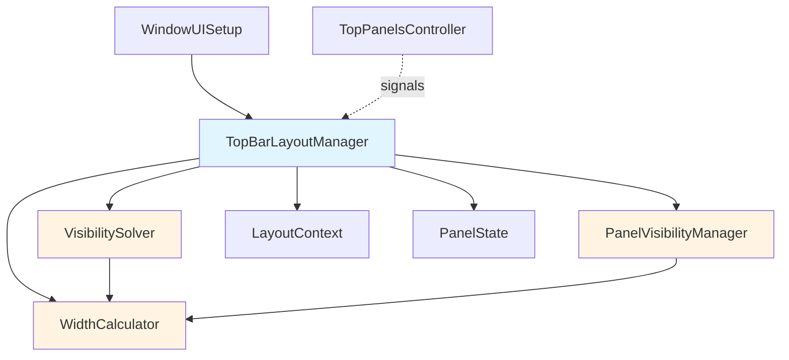
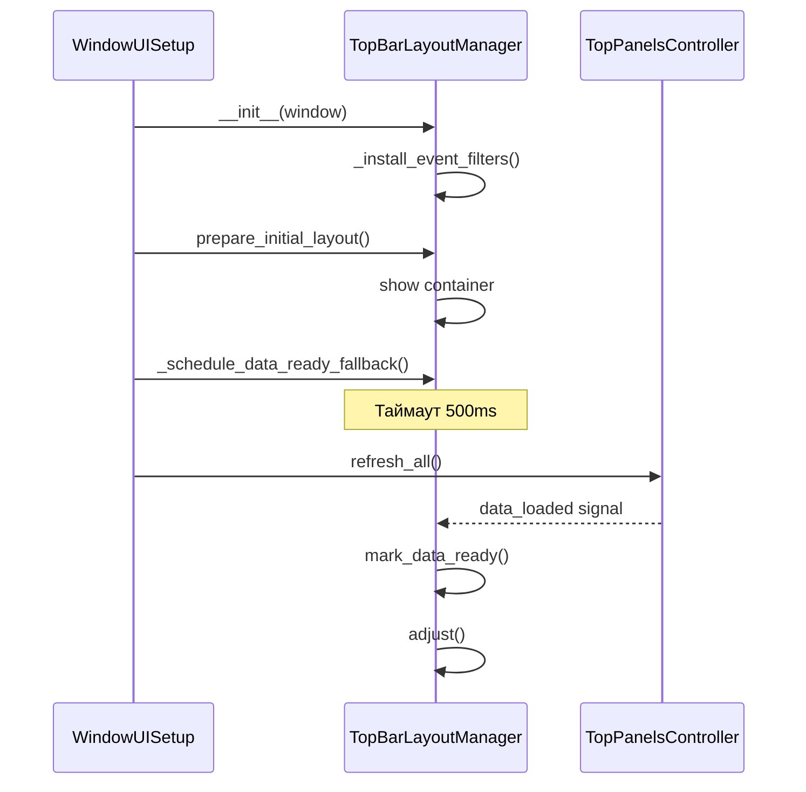
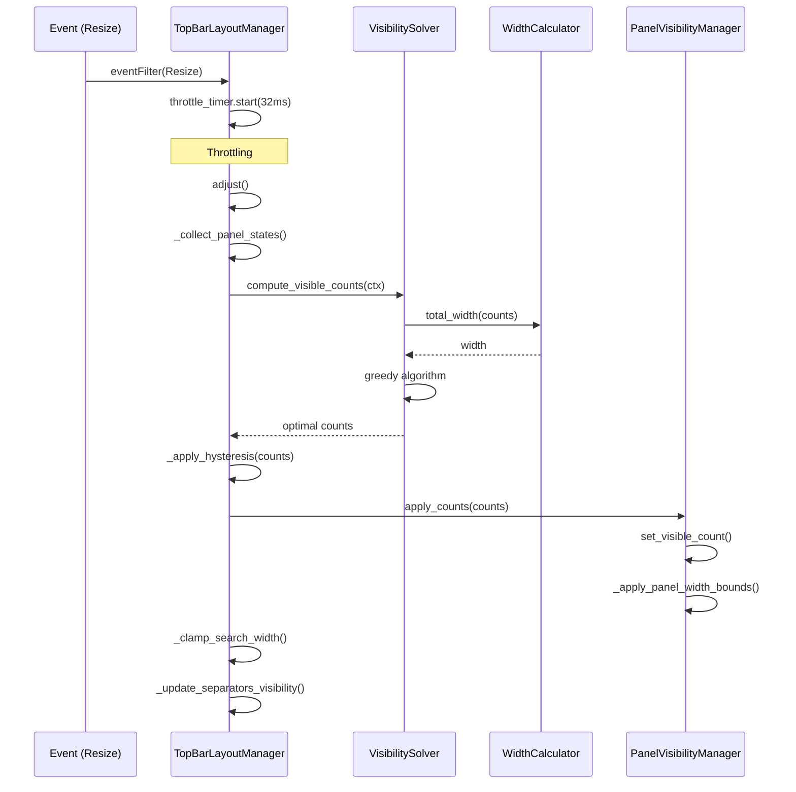

# TopBar Architecture

## Обзор

Модуль `topbar/` отвечает за управление верхней панелью приложения, включая динамическое изменение видимости кнопок панелей (Recent, Favorites, Quick Add) и адаптивное изменение ширины поля поиска в зависимости от доступного пространства.

## Архитектура

### Компоненты



### Основные классы

#### `TopBarLayoutManager`
**Роль**: Оркестратор всей логики верхней панели.

**Ответственность**:
- Отслеживание событий изменения размера окна/панелей
- Throttling пересчетов через QTimer
- Управление жизненным циклом (подключение/отключение сигналов)
- Координация работы solver, calculator и visibility manager

**Ключевые методы**:
- `adjust()` - главный метод пересчета layout
- `mark_data_ready()` - сигнализирует о готовности данных в панелях
- `cleanup()` - очистка ресурсов перед удалением

#### `VisibilitySolver`
**Роль**: Алгоритм расчета оптимального количества видимых кнопок.

**Алгоритм** (жадный с приоритетами):
1. Начинаем с максимальных значений для всех панелей
2. Вычисляем общую ширину через `WidthCalculator`
3. Если не помещается:
   - Проходим по панелям в порядке приоритета (recent → fav → quick)
   - Уменьшаем count на 1 для первой панели, у которой count > minimum
   - Повторяем, пока не поместится или не достигнем минимумов
4. Если всё равно не помещается — устанавливаем все в minimum

**Сложность**: O(n × m), где n = количество панелей, m = сумма (max - min) для всех панелей

**Защита от бесконечного цикла**: Счетчик steps с ограничением total_steps

#### `WidthCalculator`
**Роль**: Точный расчет ширины панелей и общего бюджета.

**Возможности**:
- Учет размеров кнопок (sizeHint, min/max width)
- Учет spacing, margins, frame width
- Кэширование результатов для оптимизации (O(1) lookup)
- Статистика кэша (hits/misses/hit_rate)

**Кэширование**:
- Ключ: `(panel_id, count)`
- Значение: вычисленная ширина
- Максимальный размер: 100 записей
- Стратегия eviction: полная очистка при переполнении

#### `PanelVisibilityManager`
**Роль**: Управление видимостью кнопок и анимациями.

**Ответственность**:
- Поиск кнопок в панелях через `findChildren`
- Установка видимости кнопок
- Анимация появления/скрытия (opacity fade)
- Управление шириной панелей (setMaximumWidth)

**Защита от утечек памяти**:
- Трекинг активных анимаций в `_active_animations`
- Автоматическая очистка через `finished.connect`
- Декоратор `@safe_widget_operation` для защиты от deleted widgets

#### `LayoutContext` & `PanelState`
**Роль**: Immutable data classes для передачи состояния.

**Преимущества**:
- `@dataclass(frozen=True)` предотвращает side effects
- Явная структура данных для алгоритмов
- Легко тестировать и мокировать

### Типизация

#### `TopBarWindow` (Protocol)
Определяет контракт для главного окна:

```python
class TopBarWindow(Protocol):
    search: QLineEdit
    fav_widget: Optional[QWidget]
    recent_links_widget: Optional[QWidget]
    quick_add_widget: Optional[QWidget]
    top_bar_host: Optional[QWidget]
    
    def width(self) -> int: ...
    def isVisible(self) -> bool: ...
```

#### Enums
- `PanelLabel`: "recent", "fav", "quick"
- `ButtonObjectName`: "recentButton", "favoriteButton", "quickButton"

## Жизненный цикл

### Инициализация



### Пересчет Layout



## Race Condition при инициализации

### Проблема
`adjust()` вызывается до загрузки данных в панели → поле поиска временно растягивается.

### Решение (многоуровневая защита)

1. **Флаг `_data_ready`**: Пропускаем ранние `adjust()` до готовности данных
2. **Сигнал `data_loaded`**: Controller уведомляет Manager о загрузке
3. **Fallback таймаут**: Через 500ms принудительно запускаем adjust
4. **Warmup adjusts**: Первые 2 вызова могут быть пропущены

```python
# TopBarLayoutManager
if self._warmup_adjusts_remaining > 0 and not self._data_ready:
    logger.debug("TopBarLM: skipping adjust - data not ready yet")
    return
```

## Производительность

### Оптимизации

1. **Throttling**: Resize events обрабатываются не чаще чем раз в 32ms (60 FPS)
2. **Кэширование**: `WidthCalculator` кэширует результаты `panel_width()`
3. **O(n) алгоритмы**: 
   - `_clamp_search_width()` - единственный проход по layout
   - `_update_separators_visibility()` - карта виджетов за O(n)
4. **Hysteresis**: Предотвращает дёрганье при малых изменениях размера

### Метрики

```python
# Пороги для логирования медленных операций
SLOW_ADJUST_THRESHOLD_MS = 16  # 1 frame @ 60fps
SLOW_CLAMP_THRESHOLD_MS = 8

# Context manager для измерения
with self._measure_operation("adjust", self.SLOW_ADJUST_THRESHOLD_MS):
    # ... операция
```

### Статистика кэша

```python
stats = width_calculator.get_cache_stats()
# {'hits': 150, 'misses': 50, 'size': 45, 'hit_rate': 75}
```

## Обработка ошибок

### Defensive Programming

1. **Проверка deleted objects**: `_sip_isdeleted()` перед работой с Qt
2. **Декоратор `@safe_widget_operation`**: Автоматическая защита методов
3. **Try/except везде**: Каждая операция с Qt обернута в try/except
4. **Валидация конфигурации**: `_validate_config_int()` с fallback на defaults

### Логирование

- **DEBUG**: Подробная информация о подключении сигналов, event filters
- **INFO**: Метрики производительности, видимые counts
- **WARNING**: Медленные операции, некорректная конфигурация
- **ERROR**: Критические ошибки (не должны происходить)

## Тестирование

### Unit-тесты

Расположение: `tests/test_topbar/`

**Покрытие**:
- `test_visibility_solver.py` - алгоритм compute_visible_counts
  - Все панели помещаются
  - Нужно уменьшение
  - Минимумы соблюдаются
  - Приоритет уменьшения
  - Защита от бесконечного цикла
  - Параметризованные тесты для разных ширин

**Запуск**:
```bash
pytest tests/test_topbar/ -v
pytest tests/test_topbar/test_visibility_solver.py::TestVisibilitySolver::test_compute_visible_counts_all_fit
```

### Интеграционные тесты

TODO: Добавить тесты для:
- `TopBarLayoutManager.adjust()` с реальными Qt виджетами
- Анимации в `PanelVisibilityManager`
- Кэширование в `WidthCalculator`

## Конфигурация

### app_config параметры

```python
# Throttling
ui.topbar.throttle_ms = 32  # default: 32

# Логирование
ui.topbar.log_info = False  # default: False

# Размеры
ui.get_top_panel_button_size() = 32
ui.get_top_panel_search_height() = 32
ui.get_top_panel_search_min_width() = 148

# Минимальные видимые кнопки
topbar.min_visible.recent = 0
topbar.min_visible.fav = 0
topbar.min_visible.quick = 0

# Максимальные (задаются в коде)
DEFAULT_MAX_RECENT = 10
DEFAULT_MAX_FAV = 10
DEFAULT_MAX_QUICK = 6
```

## Best Practices

### При добавлении новой панели

1. Добавить в `PanelLabel` enum
2. Добавить в `ButtonObjectName` enum
3. Добавить `PanelDefinition` в `_panel_definitions`
4. Добавить атрибут в `TopBarWindow` protocol
5. Добавить виджет в `WindowUISetup.setup_top_bar_widgets()`
6. Добавить конфигурацию min/max visible

### При изменении алгоритма

1. Добавить unit-тесты для нового поведения
2. Проверить сложность алгоритма (должна быть O(n) или O(n log n))
3. Добавить метрики производительности
4. Обновить документацию

### При рефакторинге

1. Запустить существующие тесты
2. Проверить отсутствие утечек памяти (профилировать с `memory_profiler`)
3. Проверить производительность (профилировать с `cProfile`)
4. Обновить type hints и docstrings

## Известные проблемы

### 1. Race condition при инициализации (частично решено)
**Статус**: Улучшено через fallback таймаут  
**Остаточный эффект**: Возможно кратковременное растягивание search (< 50ms)  
**Решение**: Требует строгого порядка инициализации или скрытие topbar до готовности

### 2. Отсутствие интеграционных тестов
**Статус**: TODO  
**Риск**: Регрессии при рефакторинге  
**Решение**: Добавить тесты с реальными Qt виджетами

### 3. Простая стратегия eviction в кэше
**Статус**: Работает, но не оптимально  
**Улучшение**: Использовать LRU cache вместо полной очистки

## Changelog

### 2025-09-30: Улучшения качества кода
- ✅ Добавлен `TopBarWindow` Protocol для типизации
- ✅ Добавлены Enum для магических строк (`PanelLabel`, `ButtonObjectName`)
- ✅ Улучшены type hints (заменен `object` на конкретные типы)
- ✅ Оптимизирован `_update_separators_visibility()` до O(n)
- ✅ Добавлено кэширование в `WidthCalculator`
- ✅ Добавлен fallback таймаут для race condition
- ✅ Созданы unit-тесты для `VisibilitySolver`
- ✅ Добавлена архитектурная документация

## Контакты

При вопросах или проблемах создавайте issue с тегом `topbar`.
