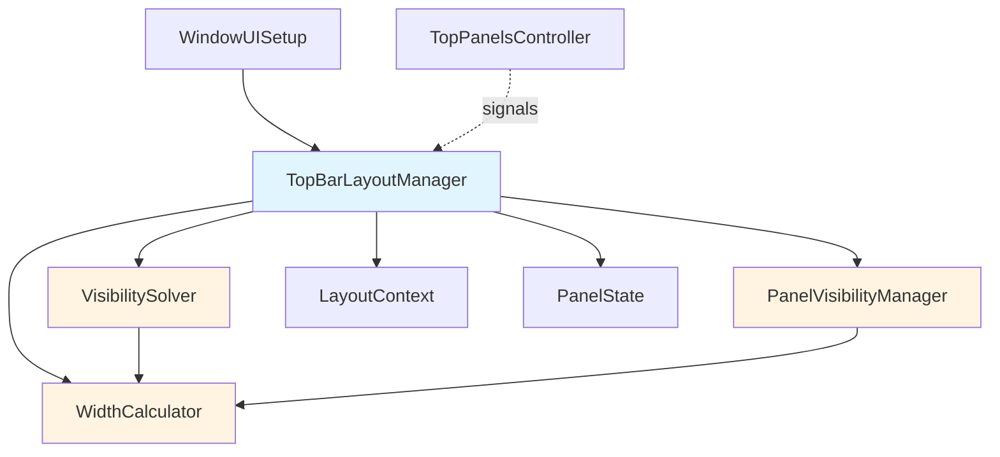
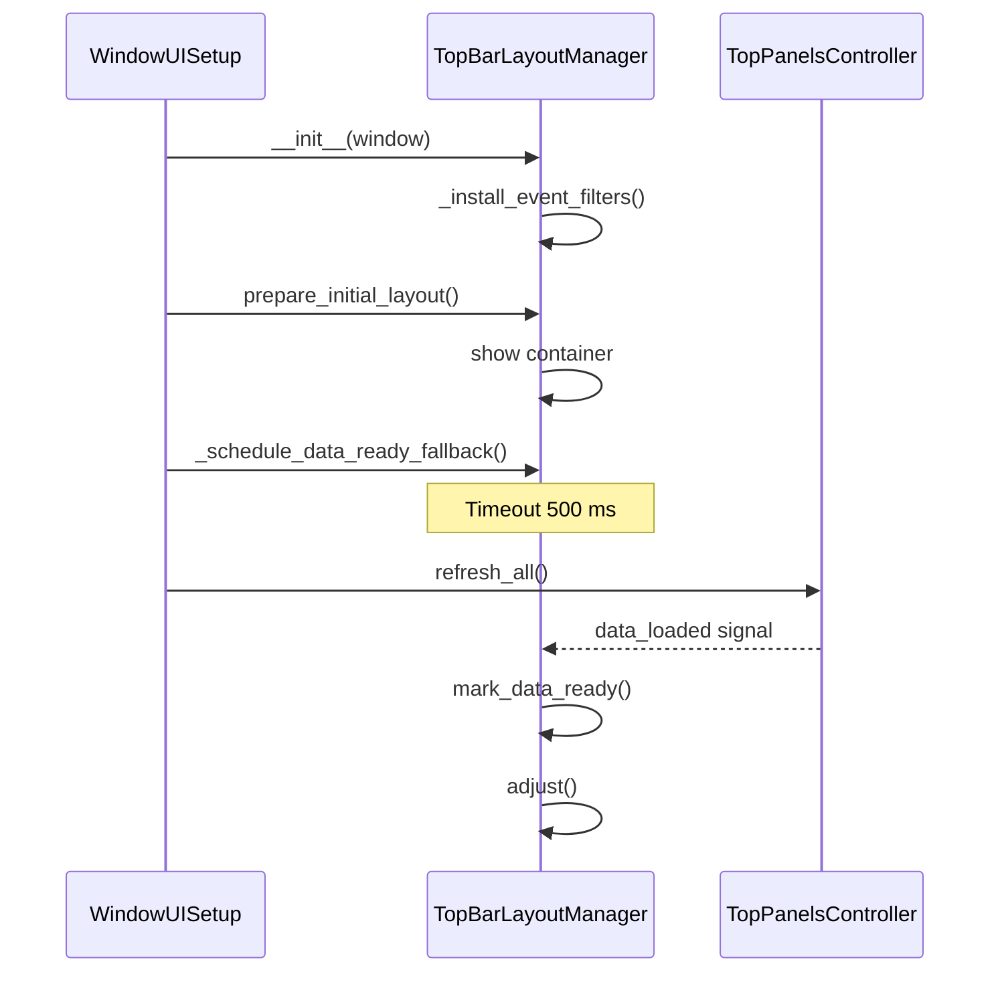
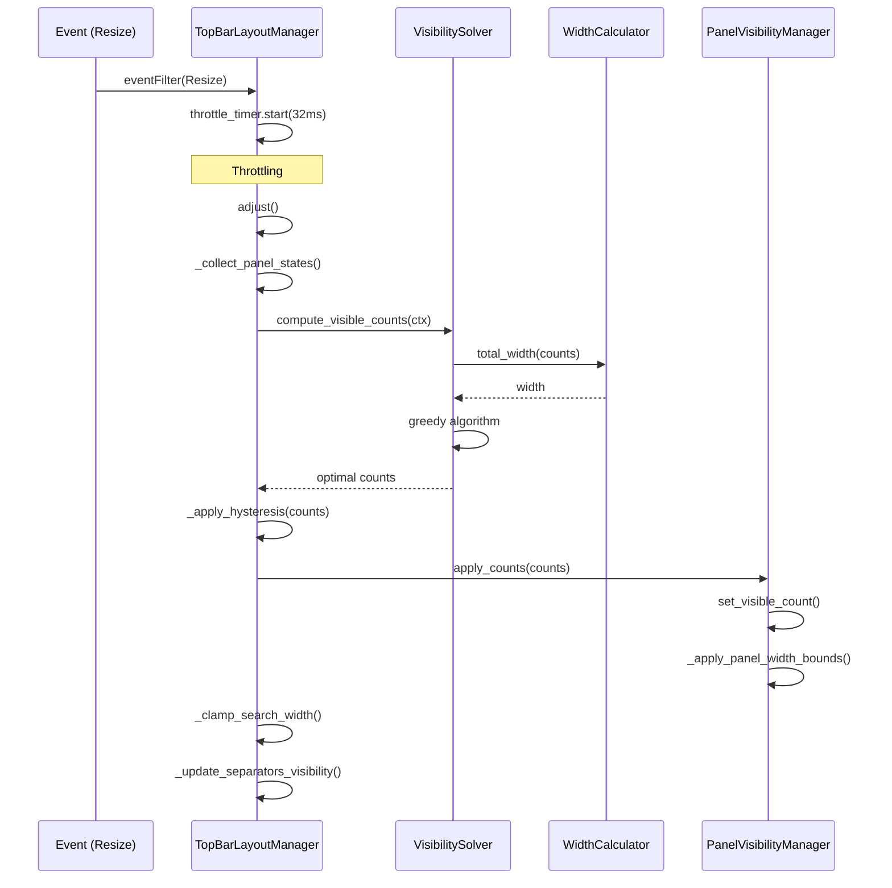

# TopBar Architecture

## Overview

The `topbar/` module manages the application's top bar, including dynamic visibility for panel buttons (Recent, Favorites, Quick Add) and adaptive resizing of the search field based on the available space.

## Architecture

### Components



### Key classes

#### `TopBarLayoutManager`
**Role**: Orchestrates the top-bar logic.

**Responsibilities**:
- Track window/panel resize events.
- Throttle recalculations via `QTimer`.
- Manage lifecycle hooks (connect/disconnect signals).
- Coordinate the solver, calculator, and visibility manager.

**Key methods**:
- `adjust()` — primary layout recomputation entry point.
- `mark_data_ready()` — signals that panel data is ready.
- `cleanup()` — releases resources before disposal.

#### `VisibilitySolver`
**Role**: Computes the optimal number of visible buttons per panel.

**Algorithm** (priority-based greedy):
1. Start from the maximum values for each panel.
2. Compute the total width via `WidthCalculator`.
3. If it does not fit:
   - Iterate over panels in priority order (recent → fav → quick).
   - Decrement the first panel whose count is above its minimum.
   - Repeat until it fits or the minimums are reached.
4. If it still does not fit, fall back to the minimum counts.

**Complexity**: O(n × m) where `n` is the panel count and `m` is the sum of `(max - min)` for all panels.

**Infinite-loop safeguard**: A `steps` counter capped by `total_steps`.

#### `WidthCalculator`
**Role**: Accurately computes per-panel widths and the overall budget.

**Features**:
- Considers button size hints and min/max constraints.
- Accounts for spacing, margins, and frame widths.
- Caches results for O(1) lookups.
- Exposes cache statistics (hits/misses/hit_rate).

**Cache**:
- Key: `(panel_id, count)`.
- Value: computed width.
- Capacity: 100 entries.
- Eviction: full clear when capacity is exceeded.

#### `PanelVisibilityManager`
**Role**: Controls button visibility and animations.

**Responsibilities**:
- Locate buttons inside panels via `findChildren`.
- Toggle button visibility.
- Animate fade-in/fade-out transitions.
- Enforce panel width constraints (`setMaximumWidth`).

**Memory safety**:
- Track active animations in `_active_animations`.
- Auto-cleanup through `finished.connect`.
- Use the `@safe_widget_operation` decorator to guard against deleted widgets.

#### `LayoutContext` & `PanelState`
**Role**: Immutable data classes used to pass state around.

**Benefits**:
- `@dataclass(frozen=True)` prevents side effects.
- Explicit data layout for algorithms.
- Easy to test and mock.

### Typing

#### `TopBarWindow` (Protocol)
Defines the contract of the main window:

```python
class TopBarWindow(Protocol):
    search: QLineEdit
    fav_widget: Optional[QWidget]
    recent_links_widget: Optional[QWidget]
    quick_add_widget: Optional[QWidget]
    top_bar_host: Optional[QWidget]
    
    def width(self) -> int: ...
    def isVisible(self) -> bool: ...
- `PanelLabel`: "recent", "fav", "quick"
- `ButtonObjectName`: "recentButton", "favoriteButton", "quickButton"

## Lifecycle

### Initialization



### Layout recomputation



## Race condition during initialization

### Problem
`adjust()` fires before the panels finish loading data, so the search field briefly stretches.

### Solution (multi-layer safeguard)

1. **`_data_ready` flag**: Skip early `adjust()` calls until data is ready.
2. **`data_loaded` signal**: The controller notifies the manager after loading.
3. **Fallback timeout**: Force an adjust after 500 ms.
4. **Warmup adjusts**: The first two calls may be skipped.

```python
# TopBarLayoutManager
if self._warmup_adjusts_remaining > 0 and not self._data_ready:
    logger.debug("TopBarLM: skipping adjust - data not ready yet")
    return
```

## Performance

### Optimizations

1. **Throttling**: Resize events are handled at most once every 32 ms (≈60 FPS).
2. **Caching**: `WidthCalculator` caches `panel_width()` results.
3. **O(n) algorithms**:
   - `_clamp_search_width()` traverses the layout once.
   - `_update_separators_visibility()` builds the widget map in O(n).
4. **Hysteresis**: Prevents jitter at small size changes.

### Metrics

```python
# Logging thresholds for slow operations
SLOW_ADJUST_THRESHOLD_MS = 16  # 1 frame @ 60fps
SLOW_CLAMP_THRESHOLD_MS = 8

# Measurement helper
with self._measure_operation("adjust", self.SLOW_ADJUST_THRESHOLD_MS):
    # ... operation
```

### Cache stats

```python
stats = width_calculator.get_cache_stats()
# {'hits': 150, 'misses': 50, 'size': 45, 'hit_rate': 75}
```

## Error handling

### Defensive programming

1. **Deleted-object checks**: Call `_sip_isdeleted()` before touching Qt objects.
2. **`@safe_widget_operation` decorator**: Adds automatic guards to member functions.
3. **Try/except everywhere**: Wrap each Qt interaction in exception handling.
4. **Configuration validation**: `_validate_config_int()` falls back to defaults.

### Logging

- **DEBUG**: Detailed information on signal hookups and event filters.
- **INFO**: Performance metrics, visible counts.
- **WARNING**: Slow operations, invalid configuration.
- **ERROR**: Critical failures (should never occur).

## Testing

### Unit tests

Location: `tests/test_topbar/`

**Coverage**:
- `test_visibility_solver.py` — `compute_visible_counts` algorithm.
  - All panels fit.
  - Reduction required.
  - Minimum constraints observed.
  - Decrement priority enforced.
  - Infinite-loop protection.
  - Parameterized widths.

**Run**:
```bash
pytest tests/test_topbar/ -v
pytest tests/test_topbar/test_visibility_solver.py::TestVisibilitySolver::test_compute_visible_counts_all_fit
```

### Integration tests

TODO: add coverage for:
- `TopBarLayoutManager.adjust()` with live Qt widgets.
- Animations handled by `PanelVisibilityManager`.
- Caching in `WidthCalculator`.

## Configuration

### `app_config` keys
# Throttling
ui.topbar.throttle_ms = 32  # default: 32

# Logging
# ...
topbar.log_info = False  # default: False

# Sizes
ui.get_top_panel_button_size() = 32
ui.get_top_panel_search_height() = 32
ui.get_top_panel_search_min_width() = 148
# Minimal visible buttons
topbar.min_visible.recent = 0
topbar.min_visible.fav = 0
topbar.min_visible.quick = 0

# Maximum defaults (set in code)
DEFAULT_MAX_RECENT = 10
DEFAULT_MAX_FAV = 10
DEFAULT_MAX_QUICK = 6
```

## Best practices

### Adding a new panel

1. Update the `PanelLabel` enum.
2. Add an entry to the `ButtonObjectName` enum.
3. Register a `PanelDefinition` in `_panel_definitions`.
4. Extend the `TopBarWindow` protocol with the new attribute.
5. Add the widget in `WindowUISetup.setup_top_bar_widgets()`.
6. Provide min/max visibility configuration.

### Modifying algorithms

1. Add unit tests for the new behavior.
2. Validate complexity (should remain O(n) or O(n log n)).
3. Add performance metrics.
4. Update this documentation.

### Refactoring

1. Run the existing tests.
2. Check for memory leaks (`memory_profiler`).
3. Profile performance (`cProfile`).
4. Refresh type hints and docstrings.

## Known issues

### 1. Initialization race condition (partially mitigated)
**Status**: Improved via fallback timeout.  
**Residual effect**: Possible short-lived search stretching (< 50 ms).  
**Resolution**: Ensure strict initialization order or hide the top bar until ready.

### 2. Missing integration tests
**Status**: TODO.  
**Risk**: Regressions during refactors.  
**Resolution**: Add coverage with real Qt widgets.

### 3. Simple cache eviction strategy
**Status**: Functional but suboptimal.  
**Improvement**: Consider an LRU cache instead of full invalidation.

## Changelog

### 2025-09-30: Code quality improvements
- ✅ Added the `TopBarWindow` protocol for typing.
- ✅ Introduced enums for magic strings (`PanelLabel`, `ButtonObjectName`).
- ✅ Improved type hints (replaced `object` with concrete types).
- ✅ Optimized `_update_separators_visibility()` to O(n).
- ✅ Added caching to `WidthCalculator`.
- ✅ Implemented a fallback timeout for the race condition.
- ✅ Created unit tests for `VisibilitySolver`.
- ✅ Documented the architecture.

## Contacts

If you have questions or encounter issues, open an issue with the `topbar` tag.
